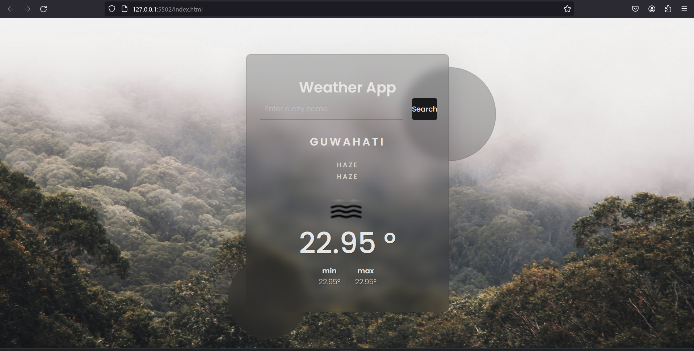

# PRODIGY_WD_05
-----

# Weather App

## Overview

This Weather App is a simple web application that allows users to search for weather information based on city names. It fetches weather data from the OpenWeatherMap API and displays it in a user-friendly interface.

## Features

- Users can enter a city name in the input field and click the "Search" button to retrieve weather information.
- The app displays the current weather condition, temperature, minimum temperature, and maximum temperature for the specified city.
- It also shows a brief description of the weather condition and an icon representing the weather status.

## Technologies Used

- HTML5: Markup language used for structuring the web page.
- CSS3: Stylesheet language used for styling the HTML elements.
- JavaScript: Programming language used for implementing dynamic functionality.
- OpenWeatherMap API: Used to retrieve weather data based on city names.

## File Structure

- `index.html`: The main HTML file that contains the structure of the web page and includes CSS and JavaScript files.
- `style.css`: The CSS file that contains styles for the layout and appearance of the web page.
- `script.js`: The JavaScript file that contains functions to fetch weather data from the API and update the UI accordingly.
- `key.js`: (Not provided in the code snippet) This file should contain your OpenWeatherMap API key. Make sure to replace `"7e3fce8abb26a627036b212534a21217"` with your actual API key.

## How to Use

1. Clone or download the repository to your local machine.
2. Open the `index.html` file in a web browser.
3. Enter the name of a city in the input field and click the "Search" button.
4. Weather information for the specified city will be displayed on the screen.

## Customization

- You can customize the styles of the app by modifying the CSS in the `style.css` file.
- To adjust the layout or functionality, you can make changes to the JavaScript code in the `script.js` file.
- Ensure that you have a valid API key from OpenWeatherMap and replace the placeholder in the `key.js` file with your actual API key.

## Screenshots 

## Credits

- This project utilizes the OpenWeatherMap API to fetch weather data.
- Fonts used in the project are from the Google Fonts library.

## Author

Rajdeep Nath

---

